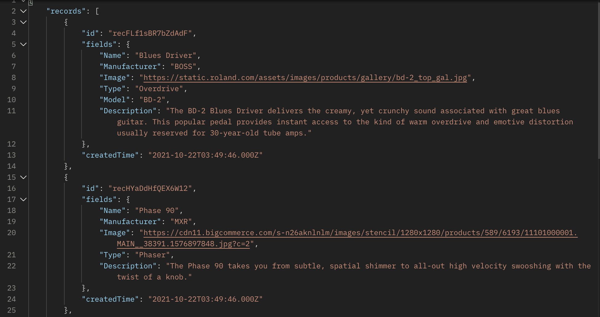

# Pedal-Base

## Project Description

A collection of popular musical effects pedals that a user can view, add to, and explore. It will have a homepage with links to view the entire list or search for a specific pedal, a starter page with basic information on effects pedals, a pageto add a pedal, and a page to pull a random pedal from the list and return it. There will also be links to each individual pedal that is accessed from the list.

## Wireframes

## Component Hierarchy

## API and Data Sample

## MVP

- Home page
- A page showing all pedals in the database
- Starter page with some background information
- A search page returning results of a user search
- A form page to add a pedal to the list
- A random pedal generator page
- A page for each pedal in the database

## Post-MVP

- A settings page for recommended settings and sound descriptions
- Additional pages for the most commonly used effects
- Add integration with Reverb API or embedded Reverb links
- React bootstrap for additional styling : https://react-bootstrap.github.io/

## Project Schedule

Day | Goal 
--- | --- 
10/22 | Complete proposal and README, create React App and components, collect initial data
10/23 | Begin integrating components, continue adding data
10/24 | Continue integrating components, continue adding data
10/25 | Finishing integrating MVP components into main App and begin styling
10/26 | Complete initial deployment and complete MVP requirments
10/27 | Begin post-MVP work and styling
10/28 | Continue post-MVP work and styling
10/29 | Present project

## Timeframes

| Component | Priority | Estimated Time | Time Invested | Actual Time |
| --- | :---: |  :---: | :---: | :---: |
| Adding data | H | 4hrs|  |  |
| Creating home and starter pages | H | 2hrs|  |  |
| Working with API for basic list| H | 2hrs|  |  |
| Adding search feature | H | 2hrs|  |  |
| Adding pedal components| H | 2hrs|  |  |
| Adding forms | H | 3hrs|  |  |
| Working with API for random generator| H | 2hrs|  |  |
| Styling | M | 6hrs|  |  |
| Total | H | 23hrs| |  |

## SWOT Analysis

Strengths: Familiar with Airtable APIs and accessing data, have a clear plan for how to fulfill all MVP requirements

Weaknesses: Styling, ambitious post-MVP goals, try to do too many things at once

Opportunities: Make a clean looking site with basic functionality and database of pedals and build from there

Threats: Spending too much time adding data to the base, not correctly implementing the search function